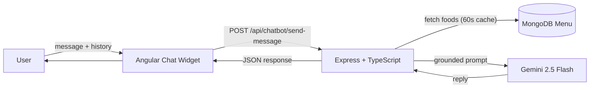

<div align="center">

# 🍔 FoodTech — A Next-Gen Food Shopping Experience

### _Order. Track. Chat with AI. Enjoy._

[](#)
[](#)
[](#)
[](#)
[](#)
[](https://aistudio.google.com/)
[](#license)
[](https://foodtech-app-mean-stack.onrender.com/)

🌐 **[🚀 Live Demo — Try FoodTech Free →](https://foodtech-app-mean-stack.onrender.com/)**

### 🎁 Free Trial — No credit card required
_Experience the full FoodTech platform instantly in your browser. Browse the menu, place orders, track deliveries, and chat with our AI assistant — **all on us**._

</div>

---

## ✨ Overview

**FoodTech** is a revolutionary full-stack food ordering marketplace built end-to-end on the **MEAN** stack with **TypeScript**. It combines streamlined ordering, personalized recommendations, real-time order tracking, vendor management, secure payments and — _now_ — an **AI-powered customer support assistant** that answers your questions grounded on the live menu.

> 🤖 **New: Project is now integrated with AI!**
> A built-in chatbot powered by **Google Gemini** helps users discover dishes, track orders, and answer FAQs — in natural language, in real time, with zero hallucinations.

---

## 🚀 Features

| | |
|---|---|
| 🛒 **Streamlined Ordering** | Browse, search, filter, cart and checkout in a few clicks |
| 💳 **Secure Payments** | PayPal integration for seamless checkout |
| 📍 **Location Aware** | Google Maps for delivery pin-drop and tracking |
| 🔐 **JWT Authentication** | Token-based security for users and admins |
| 📦 **Real-Time Tracking** | Follow your order from kitchen to doorstep |
| 🤖 **AI Chatbot (NEW)** | Google Gemini assistant grounded on your live menu |
| 📱 **Responsive UI** | Angular 17 SPA polished for desktop and mobile |
| 🧑‍🍳 **Vendor Management** | Food, tag, rating and cook-time management |

---

## 🧠 AI Integration — Powered by Google Gemini

The platform now ships with an end-to-end **AI customer support assistant**.

### 🔹 What it does
- Answers **menu / food / price / availability** questions using **only** your real MongoDB data — never invents dishes or prices.
- Tells users when a requested item (e.g. _shawarma_) **isn't available** and politely suggests the closest alternatives.
- Handles **ordering, payment, delivery, and tracking** questions in natural language.
- Maintains **multi-turn conversations** with full history.

### 🔹 How it works



### 🔹 Backend
- `@google/generative-ai` with **`gemini-2.5-flash`** (auto-fallback to `gemini-2.0-flash` / `gemini-flash-latest` on transient errors).
- Menu is loaded from `FoodModel` and cached in memory for **60 s**, then injected into Gemini's `systemInstruction` as a _source of truth_.
- Exponential-backoff retry on `429 / 5xx` responses.
- Endpoint: `POST /api/chatbot/send-message` → `{ message, history }`.

### 🔹 Frontend
- Floating chat widget (bottom-right, high z-index) with animated open/close.
- Expandable chat window with full message history.
- Multi-turn conversation state in an Angular service (`chat.service.ts`).
- Fully responsive — collapses to a near-fullscreen sheet on mobile.

---

## 🛠️ Tech Stack

| Layer        | Technology |
|--------------|------------|
| **Frontend** | Angular 17 • TypeScript • RxJS • Toastr • FontAwesome |
| **Backend**  | Node.js 20 • Express • TypeScript • Mongoose |
| **Database** | MongoDB Atlas |
| **Payments** | PayPal JS SDK |
| **Maps**     | Google Maps / Leaflet |
| **Auth**     | JSON Web Tokens (JWT) • bcrypt |
| **AI**       | Google Gemini (via `@google/generative-ai`) |

---

## ⚙️ Getting Started

### 📋 Prerequisites
- **Node.js 20+**
- **Angular CLI 17**
- **MongoDB Atlas** connection string
- **Google Gemini API key** → grab a free one at [aistudio.google.com](https://aistudio.google.com/app/apikey)

> 🎁 **Prefer not to install anything?** Try FoodTech instantly in your browser — **free trial, no credit card required** → [https://foodtech-app-mean-stack.onrender.com/](https://foodtech-app-mean-stack.onrender.com/)

### 📥 Clone

```bash
git clone https://github.com/Qursom/foodTech-app.git
cd foodTech-app-mean-stack
```

### 🔑 Environment Variables

Create **`backend/src/.env`**:

```env
Mongo_URI=<your mongodb connection string>
JWT_SECRET=<your jwt secret>
GEMINI_API_KEY=<your google gemini api key>
```

> 💡 Add `backend/src/.env` to `.gitignore` to keep your secrets safe.

### 🖥️ Run the Backend

```bash
cd backend
npm install
npm start
```

Backend ➡️ **http://localhost:5000**

### 🎨 Run the Frontend

```bash
cd frontend
npm install
ng serve
```

Frontend ➡️ **http://localhost:4200**

---

## 💬 Try the AI Chatbot

Open the app and click the 💬 bubble at the bottom-right. Give it a go:

- _"What foods do you have?"_
- _"Do you have pizza?"_
- _"What is the cheapest item on the menu?"_
- _"Do you serve shawarma?"_ → will tell you it's not on the menu and suggest alternatives 🎯
- _"How do I place an order?"_

---

## 🗂️ Project Structure

```
foodTech-app-mean-stack/
├── backend/
│   └── src/
│       ├── configs/        # DB config (+ DNS override for Windows)
│       ├── models/         # Food / User / Order models
│       ├── router/         # food, user, order, chatbot routers
│       ├── services/       # chatbot.service.ts  ← 🤖 Gemini integration
│       └── server.ts
└── frontend/
    └── src/app/
        ├── components/partials/chatbot/   # 💬 chat widget
        ├── services/chat.service.ts       # conversation state
        └── shared/constants/urls.ts       # API endpoints
```

---

## 🧭 API Endpoints (selected)

| Method | Endpoint                         | Description                 |
|-------:|----------------------------------|-----------------------------|
| GET    | `/api/foods`                     | List all foods              |
| GET    | `/api/foods/search/:term`        | Search foods                |
| GET    | `/api/foods/tags`                | List tags with counts       |
| POST   | `/api/users/login`               | User login → JWT            |
| POST   | `/api/users/register`            | User registration           |
| POST   | `/api/orders/create`             | Place an order              |
| POST   | **`/api/chatbot/send-message`**  | 🤖 Chat with the AI assistant |

---

## 📜 License

This project is licensed under the **MIT License**.

<div align="center">

Made with ❤️ and 🤖 by the **FoodTech** team

⭐ _If you like this project, drop a star on GitHub!_ ⭐

</div>
